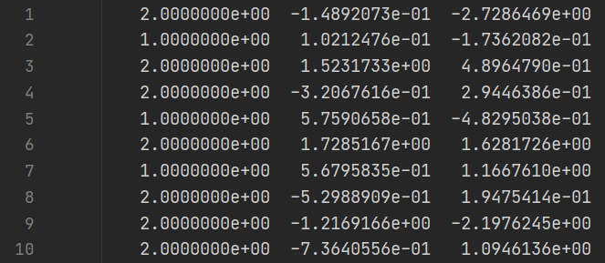
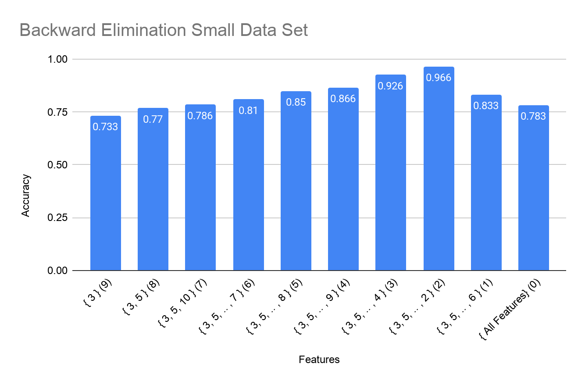
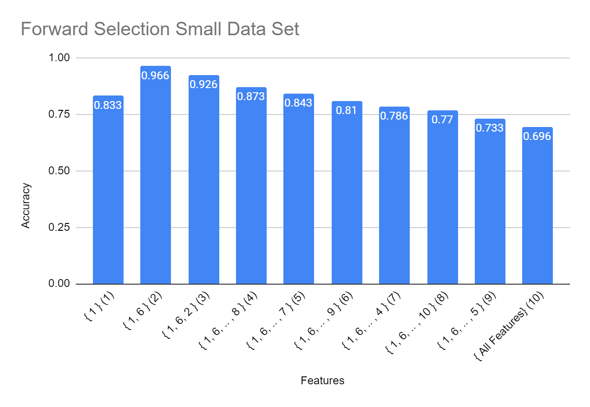
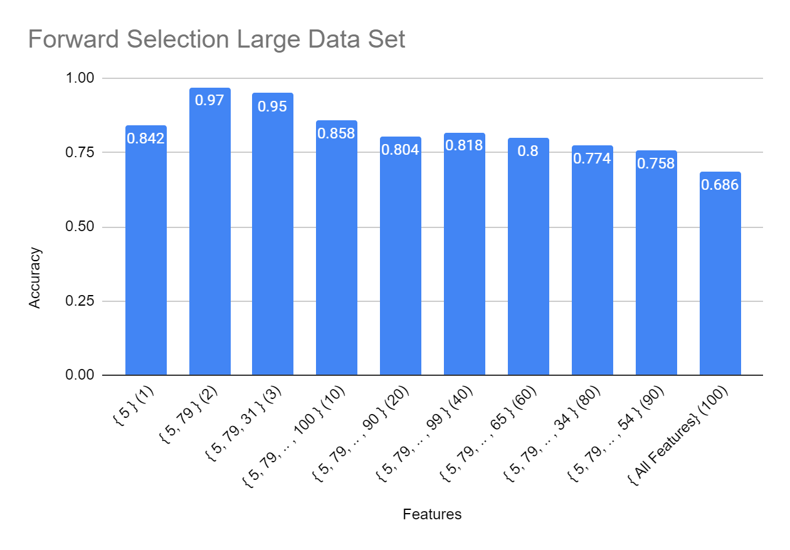
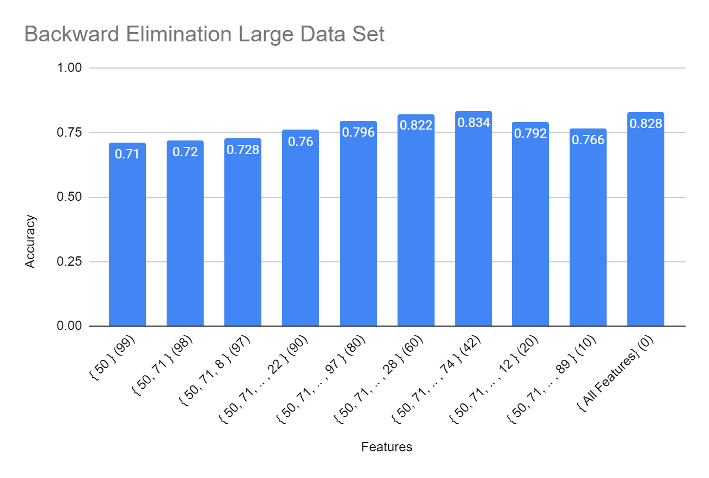

### **Introduction**

In this project, we explore feature subset selection methods involving the nearest neighbor algorithm. These methods are applied on sets of tabulated data with each instance having a classifier and a collection of features. As a result of these methods, we can discover a subset of features that most accurately defines the instance’s classifier.

In this report, I will utilize the nearest neighbor classification algorithm and two search algorithms:

**Nearest Neighbor**

The nearest neighbor classification algorithm considers an instance and identifies its nearest neighbor instance. This identification is done by considering that instance and the neighboring instances’ feature values and calculating a distance metric. The neighbor instance with the lowest distance metric value is considered to be the nearest neighbor instance. In this algorithm, the instance itself is not considered a neighbor.

**Forward Selection**

The forward selection search algorithm starts with an empty set of selected features and a full set of unselected features. We evaluate that entire set of unselected features and choose the feature with the highest accuracy. We add that feature with the highest accuracy to our set of selected features and remove it from our set of unselected features. We repeat until our set of selected features are full and our set of unselected features are empty.

**Backward Elimination**

The backward elimination search algorithm is similar. This time, it starts with only a full set of selected features. We evaluate that entire set of selected features and choose the feature with the highest accuracy. We _remove _that feature with the highest accuracy from our set of selected features. We repeat until our set of selected features are empty.

### **Accuracy Comparison Analysis**

The two search algorithms were tested with two data sets provided by Dr. Keogh. A small data set of 300 instances, with each instance having a class and 10 features. A large data set of 500 instances, with each instance having a class and 100 features.

Figure 1. An example of the data set. The first column is the classifier and the remaining columns are the features.

**Forward Selection - Small Data Set**

Figure 2: Accuracies of increasingly large subsets calculated with the forward selection search algorithm on the small data set. The brackets enclose the **added features** in the subset. The parentheses enclose the number of removed features in the subset. For example, the third subset has an accuracy of 0.926, with the subset of features 1, 6, and 2 and the subset count is 3.

The forward selection search algorithm identified the accurate subset of features very quickly. The most accurate subset, with an accuracy of 0.966 and the added features { 1, 6} was found in the second search level. The accuracies of the following subsets followed a decreasing trend. 

**Backward Elimination - Small Data Set**

Figure 3: Accuracies of increasingly large then decreasingly small subsets calculated with the backward elimination algorithm on the small data set. The brackets enclose the **removed features** in the subset. The parentheses enclose the number of added features in the subset. For example, the eighth subset has an accuracy of 0.966, with the removed features 3, 5, and 10, and added features 1, 2, 4, 6, 7, 8, and 9 and the subset added feature count is 7.

The backward elimination search algorithm identified the accurate subset of features relatively slower. The most accurate subset, with an accuracy of 0.966 and the added features { 1, 6}, and the removed features { 3, 5, 10, 7, 8, 9, 4, and 2 } was found in the eighth search level. The accuracies of the following subsets followed a decreasing trend. 

**Forward Selection - Large Data Set**

Figure 4: Accuracies of increasingly large subsets calculated with the forward selection search algorithm on the large data set. The brackets enclose the **added features** in the subset. The parentheses enclose the number of removed features in the subset. 

Again, the forward selection search algorithm identified the accurate subset of features very quickly. The most accurate subset, with an accuracy of 0.97 and the added features { 5, 97 } was found in the second search level. The accuracies of the following subsets followed a decreasing trend. 

**Backward Elimination - Large Data Set**

Figure 5: Accuracies of increasingly large then decreasingly small subsets calculated with the backward elimination algorithm on the large data set. The brackets enclose the **removed features** in the subset. The parentheses enclose the number of added features in the subset.

Again, the backward elimination search algorithm identified the accurate subset of features relatively slower. The most accurate subset, with an accuracy of 0.834 and the added features { 98, 74, 72, 7, 30, 57, 86, 5, 53, 31, 40, 49, 63, 58, 13, 35, 18, 66, 24, 32, 55, 12, 21, 84, 1, 36, 33, 76, 23, 80, 51, 89, 16, 69, 88, 75, 61, 79, 60, 11, 4, 15 }, and the removed features { 50, 71, … , 74 } was found in the 58th search level. The accuracies of the following subsets followed a decreasing trend, but spiked at the 100th search level.

### **Performance Comparison Analysis**

This project’s program was implemented in C# 7.0. The program was run on a Ryzen 7 2700x Eight-Core Processor (16 CPUs, ~3.7GHz) and 32GB RAM.

<table>
  <tr>
   <td>Search Algorithm
   </td>
   <td>Small dataset
   </td>
   <td>Large dataset
   </td>
  </tr>
  <tr>
   <td>Forward Selection
   </td>
   <td>1.8 seconds
   </td>
   <td>25 minutes 42 seconds
   </td>
  </tr>
  <tr>
   <td>Backward Selection
   </td>
   <td>2.3 seconds
   </td>
   <td>32 minutes 29 seconds
   </td>
  </tr>
</table>

My implementation of the program follows Dr. Keogh’s pseudo code except for the approach on how to calculate the feature values in a subset. Dr. Keogh proposes a solution where you set the non checked feature values to zero. However, I have assembled the data such that the program can index the data by the exact features in the current subset. I had an increase in performance, but at the cost of memory for caching extra data.

### **Conclusions**

*   Considering only the small data set, forward selection and backward elimination had the same level of accuracy. Both search algorithms concluded with the subset { 1, 6} having the highest accuracy of 0.966. However, backward elimination’s performance was relatively slower. 
    *   One explanation for the slower performance is that back elimination starts with a subset containing all the features and removes the feature one by one until that subset is empty. Because there are 10 features and this subset {1 , 6 } has two features, backward elimination has to parse 80% of the features whereas forward selection has to parse only ~20% of the features.
*    Considering only the large data set, backward elimination did not discover the same level of accuracy forward elimination did. Forward selection’s most accurate subset had an accuracy of 0.97 and the features { 5, 97 }. Backward elimination removed feature 97 at level 20 and removed feature 5 at search level 66 and its most accurate subset was discovered at search level 58.
    *   Here, backward elimination seems to have made an incorrect removal choice and then an incorrect addition choice.
*   Considering only both data sets, forward selection was very accurate and fast, identifying a very accurate subset very early on. Backward elimination was accurate, but slow on the small data set, but inaccurate and still slow on the large data set.
*   A bottleneck for performance in both algorithms was the square root step in the neighbor distance calculation. Because all the feature precision values fall within a definable range, it may be a valid approach to reduce the precision in this square root calculation, consequently increasing performance. 
    *   However, caching those resulting square root values instead would drastically improve performance - there are many, many repeated calculations.